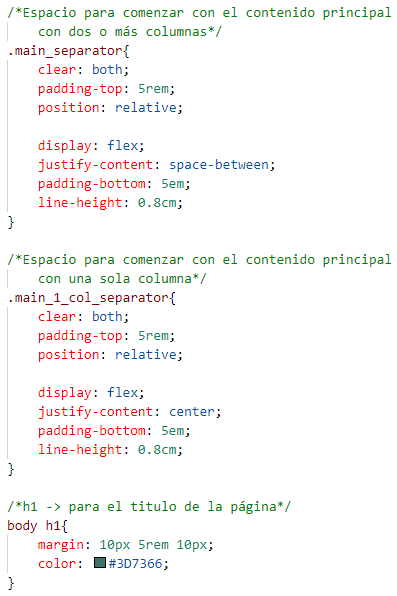
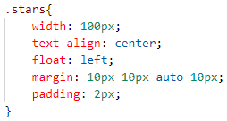
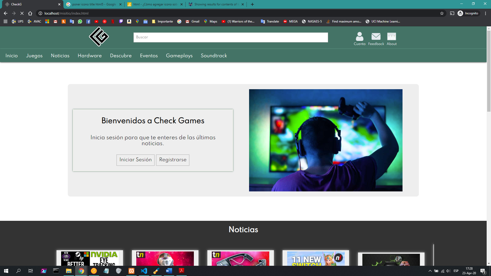

# UNIVERSIDAD POLITÉCNICA SALESIANA

### Ingeniería en Ciencias de la Computación
### Programación Hipermedia
### Practica02: MiSitioWeb con CSS
### Estudiante: Eduardo Zhizhpon

## Practica 02 - Resolución de problemas sobre CSS3.

Para el desarrollo de esta práctica se optó por dividir los estilos en los siguientes archivos:

- main_format.css: diseño para la barra de navegación superior y el pie de página.
- index_layout.css: diseño exclusivo para la página principal del sitio (index.html).
- layout_nav.css: diseño para la columna de navegación de la página.
- layout_main_section.css: contiene el diseño para el contenido principal de la página.
- layout_aside.css: diseño para la columna destina a publicidad de la página.
- layout_table.css: diseño para las tablas.
- layout_form.css: diseño para formularios.
- layout_iframe.css: diseño para el selector iframe.
- layout_video.css: diseño para el selector de video.
- layout_album.css: diseño para los álbumes de música que se presentan en el sitio web.

Al dividir el diseño se intenta lograr que cada sección del sitio pueda utilizar el estilo que necesite, para poder completar la presentación general al usuario y así lograr concordancia entre todas las páginas web.

## Explicación del contenido de los estilos CSS:

### main_format.css: 

En esta hoja de estilo, se importó y se aplicó el tipo de letra descargado de Google Fonts. Además de establecer un margin y padding de 0, con la intención de quitar la configuración de los navegadores por defecto y se establece el color principal a la barra de navegación superior, además de usar un box-shadow para dotar de una sombra al borde del header.

 
- Para el diseño de superior de la barra, que contiene un logo, input de texto e iconos con enlace a otras páginas, se aplicó al contenedor un display “flex” con “justify-content center”, con esto se logra centrar el contenido, cabe recalcar que este método contenedor-elementos se utiliza en las demás hojas de estilos con la misma intención.

 
- Para los íconos, se usa la configuración “margin auto” a la izquierda, usando el respectivo shorhand. Con esto permite que las imágenes, en este caso los íconos, se centren en relación con el texto inferior de manera horizontal.

- Para cada ícono se le dio una clase “nav_icon”, y para el texto se usó la etiqueta “span”. Para el input de buscar se usó la misma lógica, dando un “width” y “margin” respectivos, para un resultado netamente estético.

- Para el diseño de la etiqueta “nav” con sus respectivos enlaces “a href” para la navegación entre páginas, se le asignó el id “header_nav”, con “clear both” para limpiar las configuraciones anteriores, “overflow hidden” para que se muestre siempre el contenido y no genere barras de desplazamientos.

- Para lograr una mejora en el diseño de la barra, se usó “hover” para cambiar de color cuando el puntero del ratón este sobre la etiqueta “a” con la clase “nav_a”, para quitar el diseño por defecto de esta etiqueta se usó “text-decoration none”, además de los colores de letras y fondo.

- Además, se usó “transition all 0.3s linear”, para que tenga una pequeña animación cuando cambia de color, los valores se escogieron con percepciones estéticas.

- Para el diseño del footer, se usó “display flex”, con las respectivas adiciones, con esto se logra agrupar a los asides en columnas, con el tamaño adecuado para que 

- Se usó para el footer la clase “footer_content” para hacer referencia a una columna, y se usaron las siguientes configuraciones con intención estética. Lo que resalta es el uso de “text-overflow ellipsis” para cortar el texto que se salga del contenedor.

El resto de las configuraciones son netamente estéticas. Lo que se puede resaltar es lo siguiente.
- Para lograr el separado entre los logos de Facebook, Twitter y el del sitio web, se optó por usar un “display flex” con “justify-content space-around”, que genera un espaciado al lado izquierdo y derecho de cada ícono, con respecto al borde del contenedor y elementos. Además de asignar un “margin auto” a cada imagen para que se centre con respecto al contenedor, cabe recalcar que en la mayoría de las hojas de estilos se utiliza la misma configuración.

- Para lograr un estándar y poder utilizar las mismas hojas de estilos en todos los apartados del sitio, se usó un class “main_separator” que separa el contenido principal del header, esto con la finalidad de aplicar “display flex” con “justify-content space-between” para un diseño de dos o tres columnas.

- Se usó “display flex” con “justify-content center” con la clase “main_1_col_separator”, para una columna. El resto de los atributos son netamente estéticos, además de incluir el diseño del título para cada página.

### index_layout.css:

Nota: para lograr el mayor parecido al diseño propuesto en la práctica, además de usar la lógica y tamaños especificados en la anterior hoja para cada etiqueta, esta hoja también es la referencia principal para el resto de los archivos CSS. Por lo que se optará por explicar de manera general.

La página se dividió en secciones con los siguientes id: “section_welcome”, “news”, “reviews”, “team”. Que conforman las filas de la página, usando la relación contenedor-elemento.

- En este caso se usó “display flex” al contenedor, con “float left” en el elemento imagen, lo que permite que la imagen se muestre a la derecha del texto.

- Para lograr el efecto de cartas en la sección de “news” se usó la siguiente configuración: “overflow-x auto” para crear una barra de desplazamiento si fuese necesario, “white-space nowrap” para que continúen los “article”, las noticias, en una fila sin saltos de línea. Para el “article” se usó “display inline-block” para que se muestren en orientadas a una fila.

- Para la sección de “reviews” se optó por usar “display grid” para que muestre el contenido por filas, también se usó un límite de altura y un “overflow-y auto” para que genere una barra de desplazamiento en el eje Y si fuese necesario.

- Para las estrellas se usa “span” para que el texto sea continuo, y el atributo “float left” para que el texto se acople a la derecha del contenedor de la imagen.

 
- Para la sección “team” se usó la misma lógica de news, pero con diferentes configuraciones estéticas.

### layout_nav.css:

Esta hoja de estilo se usó para las páginas que requieren una columna de navegación de los contenidos. También se personalizó la presentación por defecto del navegador, para que se integre en el diseño general del sitio. En este caso, no hay una configuración relevante, solo estética.

### layout_mani_section.css:

Esta hoja de estilo está destinada para presentar el contenido principal, en los diseños de una, dos o tres columnas. 

- Se agragó un “section”, con el id “c_main” a la estructura anterior de los archivos HTML.Se usó “border-radius” para dar un efecto circular al borde del contenedor general. Además de colores y tamaños de “margin” y “padding” respectivos para el resto de las etiquetas.

 
- Para cada artículo, y con la intención de que solo afecte a los encabezados “h3” y “h4” que pertenezcan al mismo “article”, se usó la siguiente configuración de patrones con “>”.

- También se incluyó un diseño para “aside”, que consta de un “float rigth” para que se posicione a la derecha del texto, además de configuraciones netamente estéticas a las etiquetas “h4”, “p” y “a” que se pueden llegar a incluir en el contenido del mismo.

### layout_aside.css:

Esta hoja de estilo se utilizó para presentar una columna de publicidad en el sitio web, y es utilizada para los diseños de dos y tres columnas. Este diseño tiene las mismas propiedades estéticas del aside usado en layout_mani_section.css, lo que cambia es el contenedor de este, el cuál usa un ancho de 25% para acoplarse correctamente como una columna más y no afecte al resto.

### layout_table.css:

Esta hoja de estilo tiene solo una función estética para que sea utilizable en varias páginas.

- Se proporcionó un ancho mínimo de 300px, con finalidad que el contenido pueda verse, por lo que se activó “overflow auto” para que genere una barra de desplazamiento y no perder de vista el contenido, de esta manera poder hacerlo responsivo.

### layout_form.css:

Esta hoja de estilo se usó para dar diseño a los formularios.

- Los labels irán a la izquierda y los inputs a la derecha, por lo que se usó un “display inline-block” en “label” para que se presente en una línea, con tamaño del 30%. 

- Para los “input” de tipo “text”, “email”, “password” y “date”, aunque este último tiene incompatibilidad con navegadores antiguos, se les dio la siguiente configuración. “display inline-block” para una presentación en fila, “outline none” para quitar el diseño del navegador, “font-family inherit” para que tome el tipo de letra proporcionado al body y no el por defecto, además de configuraciones estéticas.

- Para el botón se usó “clear both” para limpiar las configuraciones anteriores de posicionamiento, y un “float right” para que se ubique a lado derecho del formulario.
 
 
 
### layout_iframe.css:

Esta hoja de estilo se usa para proporcionar un diseño distintivo a los videos, ya que son recursos de otros sitios, se optó por encerrarlos en “blockquote” y proporcionar colores.

- Para que el tamaño sea responsivo, se configuró la “position relative”, “width 70%, “padding-bottom 39.382%” que se ajusta al formato estándar de 16:9.

- Es importante que el “iframe” como tal tenga un “width” y “height” del 100% y una posición absoluta a 0 de todos lados.

### layout_video.css

Esta hoja de estilo tiene solo una funcionalidad estética para el contenedor del video, y se usa “display inline-block” para que se centre con respecto a su contenedor. Y Se limitó el ancho a 700px.

 

### layout_album.css

Para la presentación del álbum se usó la misma lógica del video, con el agregado de que se usar un “ol”, lista ordenada, que se configuro de la siguiente manera.

## Evidencia del correcto diseño de las páginas HTML usando CSS

### Diseño del index.html

### Diseño web con base a dos columnas

### Diseño web con base a tres columnas

## Validaciones de archivos CSS

### main_format.css

### index_layout.css

### layout_nav.css

### layout_main_section.css

### layout_aside.css

### layout_table.css

### layout_form.css

### layout_iframe.css

### layout_video.css

### layout_album.css

## Validaciones de archivos HTML

### index.html
 

### account.html

La única advertencia hace referencia al uso del input date, ya que nos avisa que no todos los navegadores lo soportan.
 

### about.html

 

### news.html

 

### hardware.html

### games.html

### soundtrack.html

### gameplays.html

### events.html

## Resultados

Se organizó de una mejor manera el sitio de web que se creó en la anterior práctica 1, con la intención de diseñar adecuadamente elementos gráficos y se aplicó estándares actuales para la internet.

## Conclusiones

La importancia de tener clara la estructura de un archivo HTML se hace más presente cuando se intenta aplicar estilos con CSS, mediante el cual, se pude obtener resultados más optimizados y escalables para seguir creando archivos o apartados del sitio web, utilizando los mismos estilos o adaptándolos a las nuevas necesidades.

## Recomendaciones

Leer la documentación de las etiquetas y su uso en la web.
Usar el validador w3 para comprobar la correcta estructura del sitio.

#### Firma: 
